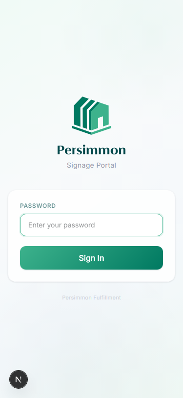
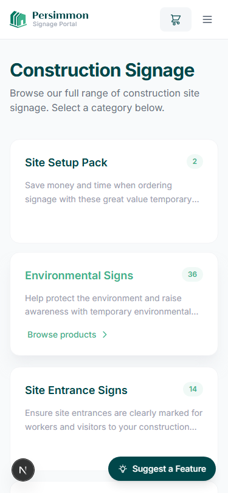

# Onesign Case Study Brochure — Creation Workflow

Replicable guide for producing branded PDF case study brochures for Onesign clients. Based on the Persimmon Homes brochure (v2).

---

## Tech Stack

| Tool | Purpose |
|------|---------|
| **HTML + CSS** | Full design control with print layout (`@page`, `page-break-after`) |
| **Puppeteer** | Headless Chrome renders HTML to pixel-perfect PDF |
| **Google Fonts / CDNFonts** | Web font loading (Gilroy-Bold headings, DM Sans body) |
| **sharp** (optional) | SVG → PNG logo conversion |

**Why not Word/docx?** The `docx` npm library has severely limited styling — no gradients, no rounded corners, no overlapping layouts, no custom fonts. HTML/CSS gives full design control.

---

## File Structure

```
docs/
├── brochure.html                    # The brochure source (all CSS embedded)
├── generate-pdf.mjs                 # Puppeteer script → PDF output
├── brochure-workflow.md             # This guide
├── screenshots/
│   ├── onesign-logo.png             # Navy logo for page headers
│   ├── onesign-logo-white.png       # White logo for cover page
│   ├── 01-login.png                 # App screenshots (mobile-width, ~375px)
│   ├── 02-homepage.png
│   ├── 03-category.png
│   ├── 04-product.png
│   ├── 08-checkout-full.png         # Tall screenshot for sidebar layout
│   ├── 09-custom-sign.png
│   ├── 09-custom-sign-preview.png
│   ├── 10-orders.png
│   └── 12-admin-orders.png
└── Persimmon-Signage-Portal-Brochure-v2.pdf   # Generated output
```

---

## Design System

### Brand Colours (CSS Variables)

```css
:root {
  --navy: #00474A;        /* Primary — headings, sidebars, cover bg */
  --navy-deep: #002E30;   /* Cover gradient start */
  --teal: #3DB28C;        /* Accent — bullets, borders, callout bars, section numbers */
  --cream: #F8F6F2;       /* Alternating page backgrounds */
  --white: #FFFFFF;
  --dark: #1A1D21;        /* Body text */
  --mid: #4A5568;         /* Secondary text */
  --light: #94A3B8;       /* Captions, metadata */
  --border: #E2E8F0;      /* Subtle dividers */
}
```

**To rebrand**: Change `--navy` and `--teal` to the client's primary and accent colours. Everything cascades from these variables.

### Typography

| Role | Font | Source | CSS |
|------|------|--------|-----|
| Headings | **Gilroy-Bold** | `https://fonts.cdnfonts.com/css/gilroy-bold` | `font-family: 'Gilroy-Bold', sans-serif; font-weight: 400;` |
| Body | **DM Sans** | Google Fonts | `font-family: 'DM Sans', sans-serif;` |

Heading styles:
```css
h1, h2, h3 {
  font-family: 'Gilroy-Bold', sans-serif;
  font-weight: 400;
  line-height: 1.15;
  letter-spacing: -0.02em;
}
```

### Page Layout

- **Format**: A4 (210mm x 297mm)
- **Content padding**: 28mm top, 22mm sides, 20mm bottom
- **Alternating backgrounds**: White and cream (`--cream`) pages for visual rhythm
- **Page break**: `page-break-after: always` on each `.page` div

---

## Key Design Patterns

### 1. Phone Screen Mockups

The signature element — screenshots displayed inside a rounded phone-style frame.

```css
.screen {
  border-radius: 18px;
  overflow: hidden;
  border: 2px solid #222;
  box-shadow: 0 8px 30px rgba(0,0,0,0.08), 0 2px 8px rgba(0,0,0,0.04);
  background: white;
}
.screen img { display: block; width: 100%; height: auto; }
```

Usage:
```html
<div class="screen" style="max-width: 56mm;">
  
</div>
```

**Important**: Screenshots should be captured at **mobile width (~375px)** so they look natural inside the phone frame. Use Puppeteer or browser DevTools mobile emulation.

### 2. Two-Up Screenshot Layout

Side-by-side phone mockups with captions:

```html
<div class="two-up">
  <div class="col">
    <div class="screen" style="max-width: 56mm;">
      
    </div>
    <span class="caption">Branded login screen</span>
  </div>
  <div class="col">
    <div class="screen" style="max-width: 56mm;">
      
    </div>
    <span class="caption">Category overview</span>
  </div>
</div>
```

### 3. Sidebar Layout (Full-Height Screenshot)

For long screenshots (e.g. checkout flow), use the sidebar layout — text on left, tall screenshot on right separated by a teal border:

```css
.sidebar-layout { display: flex; gap: 0; flex: 1; }
.sidebar-text-col { flex: 1; padding-right: 6mm; }
.sidebar-img-col {
  width: 42%;
  border-left: 2px solid var(--teal);
  padding-left: 5mm;
}
```

**Best used with**: Screenshots with an aspect ratio > 3:1 (tall and narrow). The Persimmon checkout screenshot is 375x1463px (ratio ~3.9).

### 4. Navy Sidebar Panel

Used on the Challenge page — a navy column with large white heading:

```css
.challenge-sidebar {
  width: 48mm;
  background: var(--navy);
  border-radius: 6px;
  padding: 6mm;
}
```

### 5. Section Number Watermarks

Large semi-transparent numbers (01, 02, etc.) positioned top-right on content pages:

```css
.section-num {
  font-family: 'Gilroy-Bold', sans-serif;
  font-size: 48pt;
  color: var(--teal);
  opacity: 0.15;
  position: absolute;
  top: 24mm;
  right: 22mm;
}
```

### 6. Page Header

Consistent header across all content pages (not the cover):

```html
<div class="pg-header">
  
  <span class="meta">Case Study — Client Name</span>
  <div class="accent-line"></div>
</div>
```

The accent line is a teal gradient that fades to transparent.

### 7. Callout Box

Teal left-bordered highlight box for key statements:

```css
.callout {
  background: var(--cream);
  border-left: 3px solid var(--teal);
  padding: 5mm 6mm;
  border-radius: 0 6px 6px 0;
}
```

### 8. Benefits Grid

2-column grid for listing outcomes:

```css
.benefits {
  display: grid;
  grid-template-columns: 1fr 1fr;
  gap: 3mm;
}
```

### 9. CTA Card

Navy rounded card for the closing call-to-action:

```css
.cta-section {
  background: var(--navy);
  border-radius: 8px;
  padding: 10mm 12mm;
  text-align: center;
  color: white;
}
```

---

## 8-Page Structure

| Page | Title | Layout | Background |
|------|-------|--------|------------|
| 1 | Cover | Navy gradient, Onesign logo (white), title, subtitle | Navy gradient |
| 2 | The Challenge / The Solution | Navy sidebar panel + bullets + banner + callout | White |
| 3 | The Platform | Heading + body + two-up screenshots (login, homepage) | Cream |
| 4 | Visual Product Catalog | Heading + body + two-up screenshots (category, product) | White |
| 5 | The Ordering Experience | Sidebar layout — text left, tall checkout screenshot right | Cream |
| 6 | Custom Sign Builder | Heading + body + two-up screenshots (form, preview) | White |
| 7 | Visibility & Control | Heading + body + two-up screenshots (orders, admin) | Cream |
| 8 | The Results + CTA | Banner + benefits grid + callout + navy CTA card | White |

---

## Step-by-Step: Creating a New Client Brochure

### Step 1: Capture Screenshots

Take mobile-width (375px) screenshots of the client's portal. Recommended set:

1. **Login page** — branded entry point
2. **Homepage** — category grid
3. **Category page** — product listing with images/prices
4. **Product detail** — variant selection
5. **Checkout flow** — full-page screenshot (tall, for sidebar layout)
6. **Custom sign form** — specification inputs
7. **Custom sign preview** — live rendered preview
8. **Order history** — user's order list
9. **Admin dashboard** — production team view

Save as PNGs in `docs/screenshots/`.

**For the tall checkout screenshot**: Use Puppeteer full-page capture or Chrome DevTools "Capture full size screenshot" to get the entire scrollable page in one image.

### Step 2: Prepare Logos

Convert the client's SVG logo to PNG (two variants):

```javascript
import sharp from 'sharp';

// Navy version (for page headers)
await sharp('Logo.svg')
  .resize(1200, null)
  .png()
  .toFile('docs/screenshots/onesign-logo.png');

// White version (for cover page — tint or use a white SVG variant)
await sharp('Logo-white.svg')
  .resize(1200, null)
  .png()
  .toFile('docs/screenshots/onesign-logo-white.png');
```

### Step 3: Duplicate and Edit brochure.html

1. Copy `docs/brochure.html` as your starting point
2. Update CSS variables if brand colours differ
3. Replace all screenshot `src` paths
4. Update all copy text:
   - Cover: client name, title, subtitle
   - Challenge: client-specific pain points
   - Solution: what was built
   - Feature pages: descriptions matching the client's portal
   - Benefits: client-relevant outcomes
   - CTA: correct contact email, phone, address
5. Update page headers: `Case Study — [Client Name]`
6. Update logo image paths

### Step 4: Preview in Browser

Open `brochure.html` directly in Chrome to preview. Each `.page` div renders as a separate A4 page. Check:

- Font loading (Gilroy-Bold from CDNFonts, DM Sans from Google Fonts)
- Screenshot sizing within phone frames
- Text overflow on any page
- Colour consistency

### Step 5: Generate PDF

```javascript
// generate-pdf.mjs
import puppeteer from 'puppeteer';
import { fileURLToPath } from 'url';
import { dirname, resolve } from 'path';

const __dirname = dirname(fileURLToPath(import.meta.url));
const htmlPath = resolve(__dirname, 'brochure.html');
const pdfPath = resolve(__dirname, 'Client-Name-Brochure.pdf');

const browser = await puppeteer.launch({ headless: true });
const page = await browser.newPage();

await page.goto(`file:///${htmlPath.replace(/\\/g, '/')}`, {
  waitUntil: 'networkidle0',
  timeout: 30000
});

// Wait for web fonts to load
await page.evaluateHandle('document.fonts.ready');

await page.pdf({
  path: pdfPath,
  format: 'A4',
  printBackground: true,
  margin: { top: 0, right: 0, bottom: 0, left: 0 },
  preferCSSPageSize: true
});

await browser.close();
console.log(`PDF generated: ${pdfPath}`);
```

Run with: `node docs/generate-pdf.mjs`

**Dependencies**: `npm install puppeteer` (in the repo root, not inside `shop/`)

### Step 6: Verify

Open the generated PDF and check all 8 pages. Common issues:

| Issue | Fix |
|-------|-----|
| Fonts not rendering | Increase `timeout` or add a delay after `fonts.ready` |
| Screenshots cut off | Reduce `max-width` on `.screen` elements |
| Text overflowing pages | Reduce font sizes or trim copy |
| White pages | Ensure `printBackground: true` in Puppeteer config |
| Page breaks in wrong places | Check `page-break-after: always` on every `.page` |

---

## Adapting for Non-Signage Projects

The template works for any digital product case study. The 8-page structure generalises to:

1. **Cover** — Client name, project title
2. **Problem / Solution** — Context and approach
3. **Feature Showcase 1** — Two screenshots with descriptions
4. **Feature Showcase 2** — Two more screenshots
5. **Deep Dive** — Sidebar layout for a detailed feature
6. **Feature Showcase 3** — Two more screenshots
7. **Feature Showcase 4** — Two more screenshots
8. **Results + CTA** — Benefits grid and contact details

Adjust the number of feature pages based on how many screens are worth showing. Each two-up page can be duplicated or removed as needed.

---

## Quick Reference: CSS Class Inventory

| Class | Purpose |
|-------|---------|
| `.page` | A4 page container (210mm x 297mm) |
| `.cover` | Navy gradient cover page |
| `.content` | Inner content area with padding |
| `.pg-header` | Top header bar (logo + metadata) |
| `.pg-footer` | Bottom footer bar (URL + page number) |
| `.section-num` | Large watermark number (01, 02...) |
| `.screen` | Phone mockup frame (rounded, bordered) |
| `.screen-tall` | Tall screenshot variant (for sidebar layout) |
| `.two-up` | Side-by-side screenshot layout |
| `.sidebar-layout` | Text-left / image-right split |
| `.challenge-sidebar` | Navy sidebar panel |
| `.banner` | Navy heading banner |
| `.callout` | Teal-bordered highlight box |
| `.bullets` | Styled bullet list (teal dots) |
| `.benefits` | 2-column benefits grid |
| `.cta-section` | Navy CTA card |
